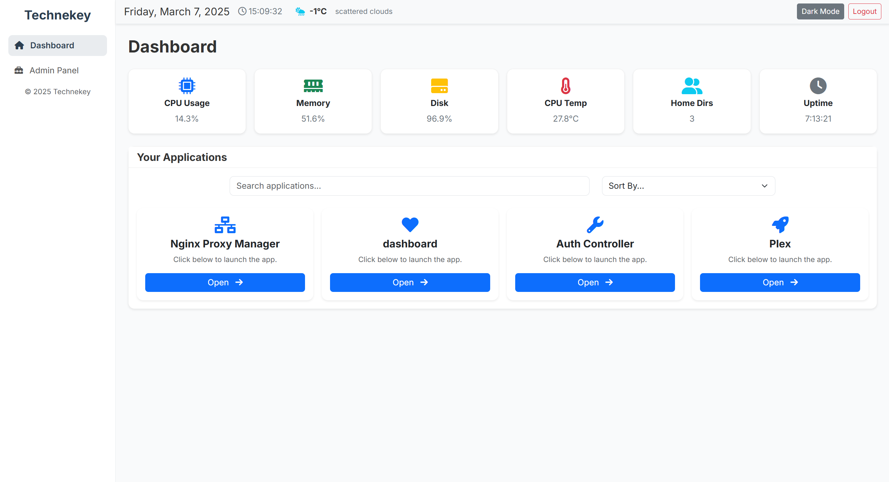
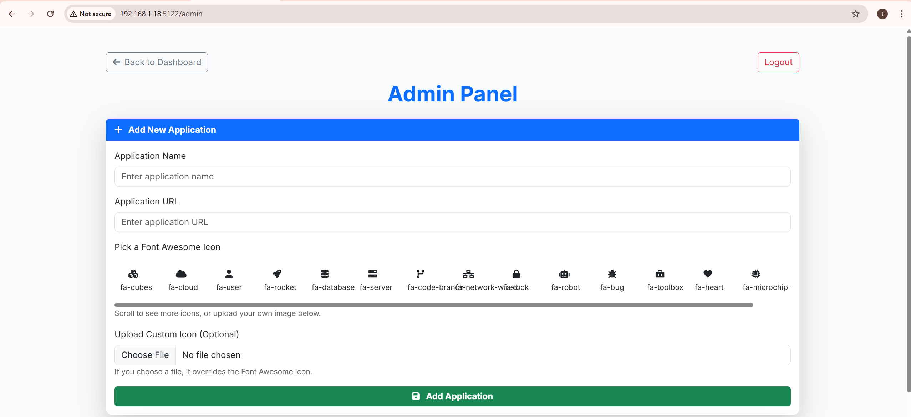
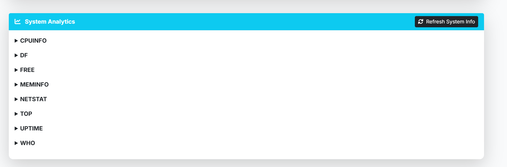

# SimpleDashboard
This is a super simple dashboard for selfhosted applications. This is nothing fancy, admin can add/remove applications to the dashboard, whereas other users can use them. This also show basic system stats, like CPU Usage, Memory, Number of users, CPU Temp etc.  

Note: I have only tested this on `Ubuntu 24.04` on LAN.  If you have any suggestions, please reach out. Thanks. 

# Installation

1. Install dependencies

```
pip3 -r requirements.txt
```

# Setup(Run helper script, provide config values)

Run the helper script, that would setup the `config.json` file for initial use.  Once `config.json` file is created, you may edit it directly at will. 

```
python3 set_password.py
A new Fernet key has been generated:
i5ePy_3ZlLNjbOrLi0Bt1sh1JbVU910vLQzj8lXt3oU=

Please store it securely and export it before running the app, e.g.:
  export FERNET_SECRET="i5ePy_3ZlLNjb..................0vLQzj8lXt3oU="
Or add that line to your ~/.bashrc or ~/.zshrc.

Enter brand name (default=Technekey):
Enter admin username: admin
Enter admin password:
Enter host (default=0.0.0.0):
Enter port (default=5123): 5122
!!!OPTIONAL: The following info is optional for weather widget.!!!

Optional: Configure Weather via OpenWeatherMap
Get an API key from https://home.openweathermap.org/users/sign_up (Check free usage limits).
Enter your OpenWeatherMap API key (or press Enter to skip): REDACTED-OPTIONAL-INFO
Enter city name for weather (default=Ottawa): Ottawa
Enable debug insights in admin panel? (y/N): y

Configuration saved to config.json.
Weather key has been encrypted and stored in config.json.
Remember to export the Fernet key (FERNET_SECRET) before running the app!
Debug Insights feature is ENABLED. System analytics will be visible in Admin Panel.

```

# Execution: 
1. Update the FERNET_SECRET env variable in your env variable

```
echo 'export FERNET_SECRET="i5ePy_3ZlLNjbOr...........JbVU910vLQzj8lXt3oU="' > ~/.bashrc
. ~/.bashrc
```

2. Start the app

```
python app.py
```

# Sample Dashboard:




# Sample Admin panel:


### Debug info(Can add as per wish from app.py)



## Note: 
About setting password, Currenlty this app do not store the password in database, it store the password as hash(argon2) into the config.json file.  The script `set_password.py` will walk through the setup. 
